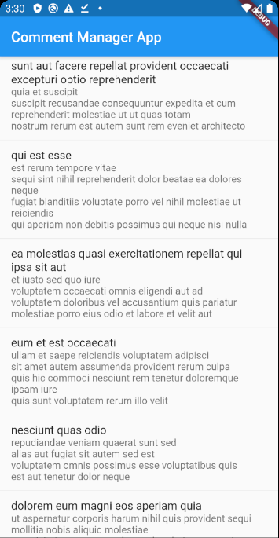
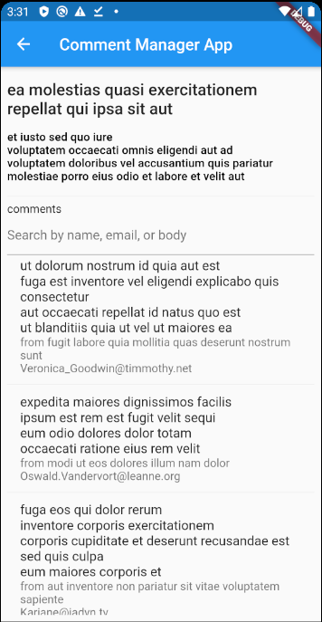
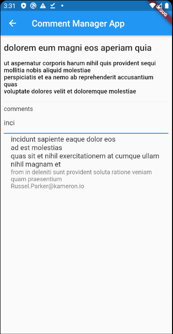

# comment_manager_app

A new Flutter project.

### Prerequisites
1. Flutter
2. Android Studio / XCode - For emulator / simulator
3. IDE - Android Studio, IntellliJ IDEA, VSCode.

### Running
1. `flutter run` on terminal or IDE configuration setup.

## Running the tests
1. `flutter test --coverage` - This will generate [LCOV](http://ltp.sourceforge.net/coverage/lcov.php)

## Formatter
1. Run `dartfmt -w lib/ test/`

## Build with
1. Architecture.
    1. [Flutter_bloc](https://pub.dev/packages/flutter_bloc) - State Management
    2. [Flutter_hooks](https://pub.dev/packages/flutter_hooks) - UI Management
    3. [Equatable](https://pub.dev/packages/equatable) - Object management (This will avoid `ObjectA() != ObjectA()`)
    4. [Intl](https://pub.dev/packages/intl) - Internationalization (supported locale is English and Malay)
    
    **note**: Internationalization is built with [Flutter_intl_jetbrain](https://plugins.jetbrains.com/plugin/13666-flutter-intl) plugins.
    There's also plugins for [vscode](https://marketplace.visualstudio.com/items?itemName=localizely.flutter-intl)

2. Services
    1. [Dio](https://pub.dev/packages/dio) - Network
    2. [Retrofit](https://pub.dev/packages/retrofit) - Network Interface

## Screenshot






## Development environment

This application does not log api network, use your own proxy client. I am using [mitmproxy](https://mitmproxy.org)

This capabilities has been configured in `main.dart`
```dart
Future main() async {
  /// Check if any proxy is detected
  final proxyConfig = await DeviceProxy.proxyConfig;
  
  if (proxyConfig.isEnable) {
    
      /// Forward request to proxy for visibility.
      (dio.httpClientAdapter as DefaultHttpClientAdapter).onHttpClientCreate =
          (HttpClient client) {
        client.findProxy = (uri) => 'PROXY ${proxyConfig.proxyUrl}';
        client.badCertificateCallback =
            (X509Certificate cert, String host, int port) => true;
      };
  }
}
```

<details>
    <summary>flutter doctor</summary>
    
```
[✓] Flutter (Channel stable, v1.12.13+hotfix.9, on Linux, locale en_US.UTF-8)
    • Flutter version 1.12.13+hotfix.9 at /home/yuzuriha/devenv/flutter
    • Framework revision f139b11009 (4 days ago), 2020-03-30 13:57:30 -0700
    • Engine revision af51afceb8
    • Dart version 2.7.2

 
[✓] Android toolchain - develop for Android devices (Android SDK version 29.0.3)
    • Android SDK at /home/yuzuriha/Android/Sdk
    • Android NDK location not configured (optional; useful for native profiling support)
    • Platform android-29, build-tools 29.0.3
    • ANDROID_HOME = /home/yuzuriha/Android/Sdk
    • ANDROID_SDK_ROOT = /home/yuzuriha/Android/Sdk
    • Java binary at: /home/yuzuriha/.local/share/JetBrains/Toolbox/apps/AndroidStudio/ch-0/192.6241897/jre/bin/java
    • Java version OpenJDK Runtime Environment (build 1.8.0_212-release-1586-b4-5784211)
    • All Android licenses accepted.

[!] Android Studio (version 3.5)
    • Android Studio at /home/yuzuriha/.local/share/JetBrains/Toolbox/apps/AndroidStudio/ch-0/191.6010548
    ✗ Flutter plugin not installed; this adds Flutter specific functionality.
    ✗ Dart plugin not installed; this adds Dart specific functionality.
    • Java version OpenJDK Runtime Environment (build 1.8.0_202-release-1483-b49-5587405)

[!] Android Studio (version 3.6)
    • Android Studio at /home/yuzuriha/.local/share/JetBrains/Toolbox/apps/AndroidStudio/ch-0/192.6241897
    ✗ Flutter plugin not installed; this adds Flutter specific functionality.
    ✗ Dart plugin not installed; this adds Dart specific functionality.
    • Java version OpenJDK Runtime Environment (build 1.8.0_212-release-1586-b4-5784211)

[✓] IntelliJ IDEA Ultimate Edition (version 2019.3)
    • IntelliJ at /home/yuzuriha/.local/share/JetBrains/Toolbox/apps/IDEA-U/ch-0/193.6911.18
    • Flutter plugin version 44.0.3
    • Dart plugin version 193.5731

[!] VS Code (version 1.43.2)
    • VS Code at /usr/share/code
    ✗ Flutter extension not installed; install from
      https://marketplace.visualstudio.com/items?itemName=Dart-Code.flutter

[✓] Connected device (1 available)
    • Android SDK built for x86 • emulator-5554 • android-x86 • Android 10 (API 29) (emulator)

! Doctor found issues in 3 categories.
```
    
</details>
    
## Authors

* [**Yusuf Rosman**](https://github.com/zaralockheart)
